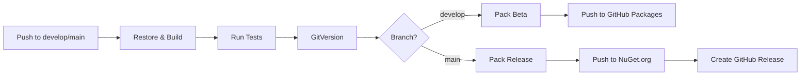

# Phase 6: Release Pipeline

[← Back to Phase 6 Overview](../phase-6-release.md)

## Overview

Automate the build, test, and publish pipeline using GitHub Actions. The pipeline ensures consistent releases, automated versioning, and quality gates before publishing to NuGet.

## Workflow Overview



## CI/CD Workflow

Create `.github/workflows/ci-cd.yml`:

```yaml
name: CI/CD

on:
  push:
    branches: [main, develop]
  pull_request:
    branches: [main, develop]

env:
  DOTNET_VERSION: '8.0.x'
  CONFIGURATION: Release

jobs:
  build-and-test:
    runs-on: ubuntu-latest
    
    steps:
    - uses: actions/checkout@v4
      with:
        fetch-depth: 0  # Full history for GitVersion
    
    - name: Setup .NET
      uses: actions/setup-dotnet@v4
      with:
        dotnet-version: ${{ env.DOTNET_VERSION }}
    
    - name: Restore tools
      run: dotnet tool restore
    
    - name: Calculate version
      run: dotnet gitversion /output buildserver
    
    - name: Restore dependencies
      run: dotnet restore
    
    - name: Build
      run: dotnet build --no-restore -c ${{ env.CONFIGURATION }}
    
    - name: Test
      run: dotnet test --no-build -c ${{ env.CONFIGURATION }} --logger "trx;LogFileName=test-results.trx"
    
    - name: Upload test results
      if: always()
      uses: actions/upload-artifact@v4
      with:
        name: test-results
        path: '**/TestResults/*.trx'
    
    - name: Pack packages
      if: github.event_name == 'push'
      run: |
        dotnet pack src/Idevs/Idevs.csproj -c ${{ env.CONFIGURATION }} -o ./artifacts --no-build
        dotnet pack src/Idevs.Application/Idevs.Application.csproj -c ${{ env.CONFIGURATION }} -o ./artifacts --no-build
        dotnet pack src/Idevs.Domain/Idevs.Domain.csproj -c ${{ env.CONFIGURATION }} -o ./artifacts --no-build
    
    - name: Upload artifacts
      if: github.event_name == 'push'
      uses: actions/upload-artifact@v4
      with:
        name: packages
        path: ./artifacts/*.nupkg

  publish-github:
    needs: build-and-test
    if: github.event_name == 'push' && github.ref == 'refs/heads/develop'
    runs-on: ubuntu-latest
    
    steps:
    - uses: actions/download-artifact@v4
      with:
        name: packages
        path: ./artifacts
    
    - name: Push to GitHub Packages
      run: |
        dotnet nuget push "./artifacts/*.nupkg" \
          --api-key ${{ secrets.GITHUB_TOKEN }} \
          --source https://nuget.pkg.github.com/${{ github.repository_owner }}/index.json \
          --skip-duplicate

  publish-nuget:
    needs: build-and-test
    if: github.event_name == 'push' && github.ref == 'refs/heads/main'
    runs-on: ubuntu-latest
    
    steps:
    - uses: actions/download-artifact@v4
      with:
        name: packages
        path: ./artifacts
    
    - name: Push to NuGet.org
      run: |
        dotnet nuget push "./artifacts/*.nupkg" \
          --api-key ${{ secrets.NUGET_API_KEY }} \
          --source https://api.nuget.org/v3/index.json \
          --skip-duplicate
    
    - name: Create GitHub Release
      uses: actions/create-release@v1
      env:
        GITHUB_TOKEN: ${{ secrets.GITHUB_TOKEN }}
      with:
        tag_name: v${{ env.GitVersion_SemVer }}
        release_name: Release ${{ env.GitVersion_SemVer }}
        body: |
          Release ${{ env.GitVersion_SemVer }}
          
          See [CHANGELOG.md](https://github.com/${{ github.repository }}/blob/main/CHANGELOG.md) for details.
        draft: false
        prerelease: false
```

## Pull Request Workflow

Create `.github/workflows/pr-validation.yml`:

```yaml
name: PR Validation

on:
  pull_request:
    branches: [main, develop]

jobs:
  validate:
    runs-on: ubuntu-latest
    
    steps:
    - uses: actions/checkout@v4
    
    - name: Setup .NET
      uses: actions/setup-dotnet@v4
      with:
        dotnet-version: '8.0.x'
    
    - name: Restore dependencies
      run: dotnet restore
    
    - name: Build
      run: dotnet build --no-restore -c Release
    
    - name: Test
      run: dotnet test --no-build -c Release --verbosity normal
    
    - name: Check formatting
      run: dotnet format --verify-no-changes --no-restore
    
    - name: Code coverage
      run: |
        dotnet test -c Release \
          --collect:"XPlat Code Coverage" \
          --results-directory ./coverage
    
    - name: Upload coverage
      uses: codecov/codecov-action@v4
      with:
        directory: ./coverage
        fail_ci_if_error: true
```

## GitHub Secrets

Configure these secrets in repository settings:

| Secret | Description | Usage |
|--------|-------------|-------|
| `GITHUB_TOKEN` | Auto-provided by GitHub | GitHub Packages push |
| `NUGET_API_KEY` | NuGet.org API key | NuGet.org publishing |
| `CODECOV_TOKEN` | Codecov token (optional) | Code coverage reporting |

## Release Branches

### Feature → Develop

```bash
# Create feature branch
git checkout -b feature/new-api develop

# Make changes and commit
git add .
git commit -m "feat: add new API"

# Push and create PR
git push -u origin feature/new-api
```

CI runs validation on PR. After approval, merge to `develop`:

```bash
git checkout develop
git merge --no-ff feature/new-api
git push origin develop
```

Triggers beta package publish to GitHub Packages.

### Develop → Main

When ready for production release:

```bash
# Merge develop into main
git checkout main
git merge --no-ff develop
git push origin main
```

Triggers:

1. Production package publish to NuGet.org
2. GitHub Release creation with changelog
3. Version tagging

## Manual Release Process

If automation fails, manual release:

```bash
# 1. Calculate version
dotnet gitversion

# 2. Build and pack
dotnet pack src/Idevs/Idevs.csproj -c Release -o ./artifacts

# 3. Push to NuGet.org
dotnet nuget push ./artifacts/Idevs.1.0.0.nupkg \
  --api-key $NUGET_API_KEY \
  --source https://api.nuget.org/v3/index.json

# 4. Create GitHub release manually via UI
```

## GitVersion Integration

GitVersion automatically calculates semantic version based on:

- Branch name
- Commit history
- Git tags
- Conventional commits

Example outputs:

| Branch | Commits | Calculated Version |
|--------|---------|-------------------|
| `main` | `feat:`, `fix:` | `1.0.0` |
| `develop` | 3 commits ahead | `1.1.0-beta.3` |
| `feature/api` | 5 commits | `1.1.0-alpha.api.5` |

## Changelog Generation

Use `dotnet-changelog` tool for automatic changelog:

```bash
# Install tool
dotnet tool install --global dotnet-changelog

# Generate changelog
dotnet changelog generate -o CHANGELOG.md
```

Or use GitHub Releases auto-generated notes.

## Testing Pipeline Locally

Use `act` to test GitHub Actions locally:

```bash
# Install act
brew install act  # macOS

# Run CI workflow
act push -j build-and-test

# Test PR validation
act pull_request -j validate
```

## Deployment Checklist

Before publishing a release:

- [ ] All tests passing
- [ ] Documentation updated
- [ ] Migration guide written (if breaking changes)
- [ ] CHANGELOG.md updated
- [ ] Version bumped correctly
- [ ] Package metadata validated
- [ ] Sample apps tested with new version

## Rollback Strategy

If a bad release is published:

```bash
# 1. Yank/unlist package on NuGet.org (via web UI)

# 2. Create hotfix branch
git checkout -b hotfix/fix-issue main

# 3. Apply fix and commit
git commit -m "fix: critical bug"

# 4. Merge to main
git checkout main
git merge --no-ff hotfix/fix-issue
git push origin main

# 5. New version publishes automatically
```

## Performance Optimization

### Caching Dependencies

Add caching to speed up builds:

```yaml
- name: Cache NuGet packages
  uses: actions/cache@v4
  with:
    path: ~/.nuget/packages
    key: ${{ runner.os }}-nuget-${{ hashFiles('**/packages.lock.json') }}
    restore-keys: |
      ${{ runner.os }}-nuget-
```

### Matrix Builds

Test on multiple platforms:

```yaml
jobs:
  build:
    strategy:
      matrix:
        os: [ubuntu-latest, windows-latest, macos-latest]
    runs-on: ${{ matrix.os }}
```

## Next Steps

- **[Contribution Guide](06-contribution-guide.md)** - Community contribution workflow
- **[Migration Guides](07-migration-guides.md)** - Version upgrade process
- **[Performance Benchmarks](08-performance-benchmarks.md)** - Automated benchmarking

---

[← Back to Phase 6 Overview](../phase-6-release.md) | [Next: Contribution Guide →](06-contribution-guide.md)
